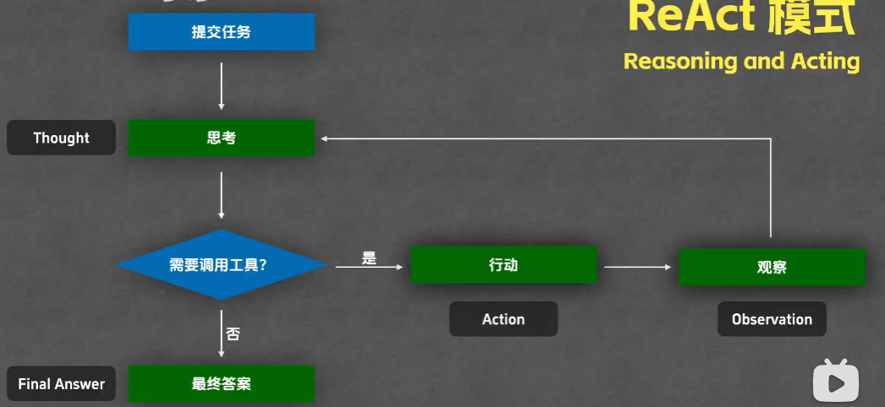
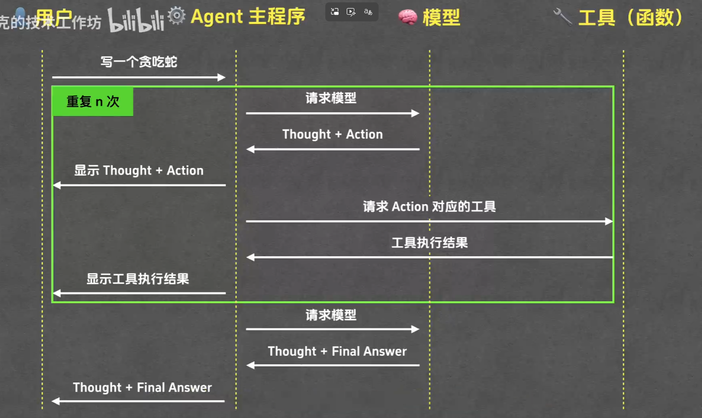
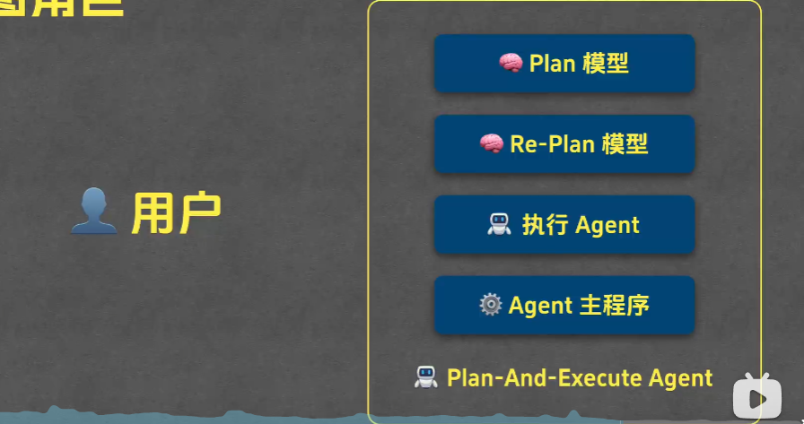
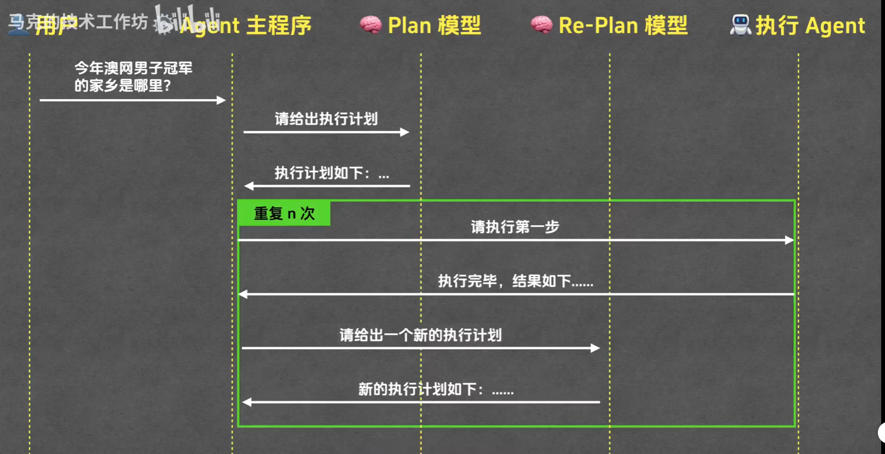

# Agent 智能体

## 定义
目前的大模型LLM仅仅是只能帮你回答问题、根据输入（文字）返回输出（文字）
比如你问：帮我写一个贪吃蛇的代码游戏
他会回答给你一串完整的可运行的html代码，但是你得**手动复制粘贴**到你的项目中去运行

核心问题显现：**大模型无法感知或者改变外界环境**（读不到你的现有代码，不能帮你直接把代码写进去）

感知 就是 **读**
改变 就是 **写**

那么有什么办法可以解决这个问题？（懒惰是科技进步的阶梯）

——是有的，解决方案就是：使用工具
什么工具呢？
读写文件内容的工具
查看文件列表的工具
运行终端命令的工具
...

## Agent 运行模式 —— ReAct
### ReAct 模式（reasoning and acting 思考与行动）

> 腾讯混元大模型的负责人提出



这种模式下可以分为四类步骤：
- Thought 思考
- Action 行动
- Observation 观察
- Final Answer 最终答案

可以参考下面这段*系统提示词*：
```
# ReAct系统提示词

## 职责描述
你需要解决一个任务。为此，你需要将任务分解为多个步骤。对于每个步骤，首先使用<thought>思考要做什么，然后使用<action>调用一个工具，工具的执行结果会通过<observation>返回给你。持续这个思考和行动的过程，直到你有足够的信息来提供<final_answer>。 

所有步骤请严格使用以下XML标签格式输出：

<task>:用户提出的任务
<thought>:思考
<action>:采取的工具操作
<observation>:工具或环境返回的结果
<final_answer>:最终答案
```

### ReAct 运行时序图
整个Agent工作流里面涉及到两个角色：*用户* 和 *Agent*
Agent又包含了三部分：Agent主程序（run函数）、Agent工具（函数）、大模型LLM

整个时序图大致流程如下：


以Agent主程序为划分，左侧部分其实就是把当前的工作内容 同步显示给 用户

## Agent 运行模式 —— Plan-and-Execute（来自 LangChain）
上面说到的**ReAct模式**其实就是不断重复一个过程：思考-行动-观察，然后得到最终答案
还有另外一种模式，会在事先创建好全部的代办列表（TodoList），然后Agent会根据这个列表去完成一件一件事



**Plan-and-Execute Agent** 可以视为一个主要Agent
但是其内部也会有各个子Agent、子Agent的模型等，比如上图中：
- Plan模型，用来制定全部的代办列表（TodoList）
- Re-Plan模型，用来优化待办列表重新生成计划等

### 主Agent和子Agent 的设计模式
主Agent：用来负责主管、监督各个子Agent任务的执行（相当于团队的TL）
子Agent：专注于执行某个部分的任务，能够把控质量

**优点**
- 主任务拆分，交给不同的专家处理，能够提升交付质量，更容易把控
- 缓解**上下文环境（Context）**的压力（主Context和子Context），降低成本，节省token
- 可操作性强，可以专注某个模块下的任务，精细化分工，多个大模型共同协作

> 这就像**电影导演（主Agent）**与**特效组、配音组、摄影组（子Agent）**的关系。导演不需要精通每一帧的渲染，但他把控整体艺术方向；各组只做自己最擅长的事，并向导演汇报进度。如果让导演一个人去画所有分镜、调所有灯光，电影永远拍不完

### Plan-and-Execute Agent 执行时序图



基于上面的例子，我们可以大致理解一下：
1. 首先我们发出**问题**：*查询今年的澳网冠军的家乡*
2. 问题提交给**Agent主程序**（也就是我们写的代码逻辑）
3. 主程序调用**子Plan Agent**，让它给我一份执行计划
4. 子Plan Agent根据问题，生成一份执行计划（TodoList）
5. **Agent主程序**根据执行计划，调用**子执行Agent**执行任务1234
6. 子Agent执行任务，得到*结果1234*
7. **Agent主程序**拿着执行计划（TodoList）、和上一步完成的*执行结果1234*一并发给**Re-Plan Agent**，告诉他给我弄一份新的执行计划 or 给我最终答案（如果已经有答案的话）
...

如此反复多次上面的3-7步骤
到最后一个第7步骤的时候，**执行Agent**会发现，哎用户的问题已经有答案了，因此会直接返回最终答案