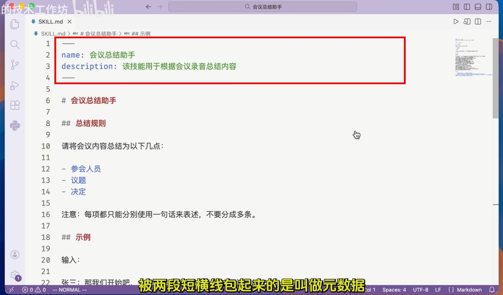
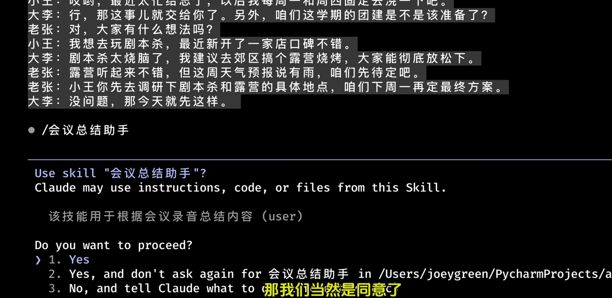
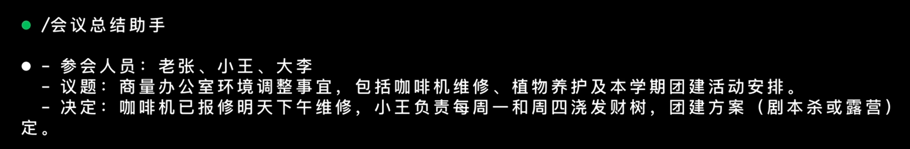
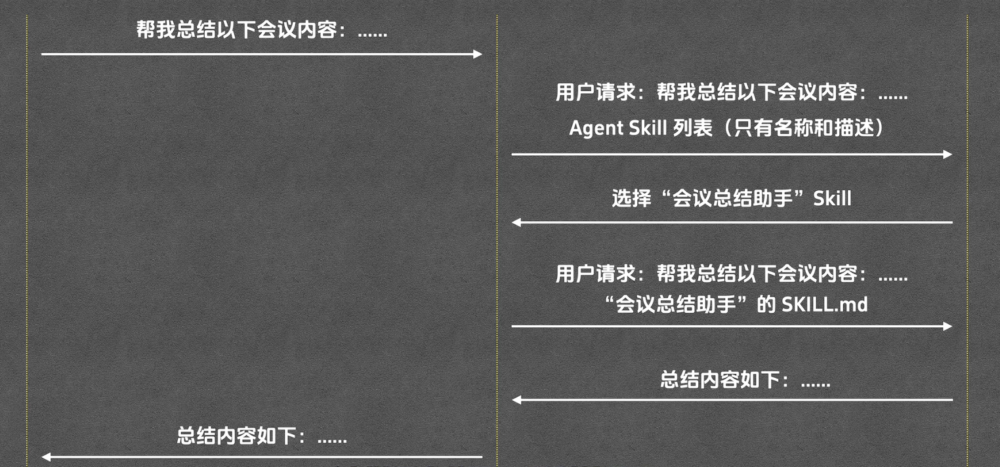
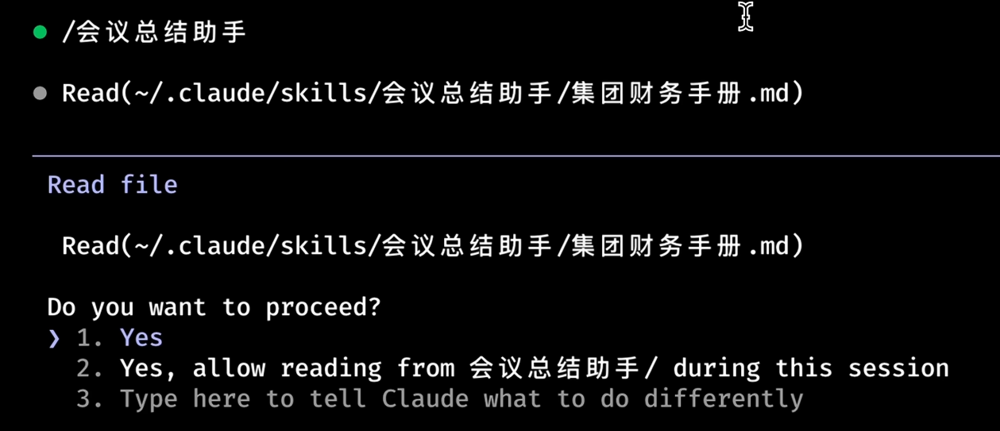
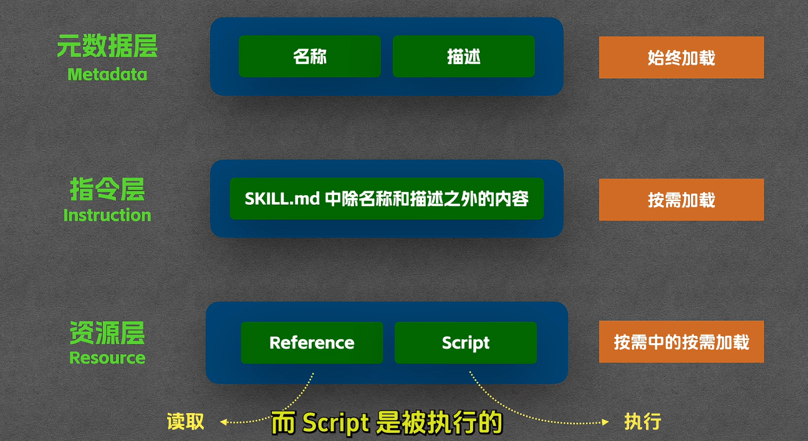
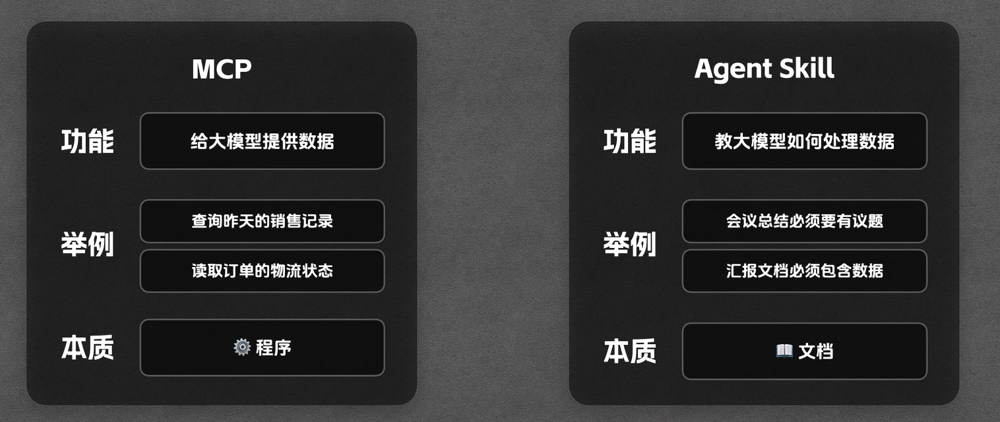
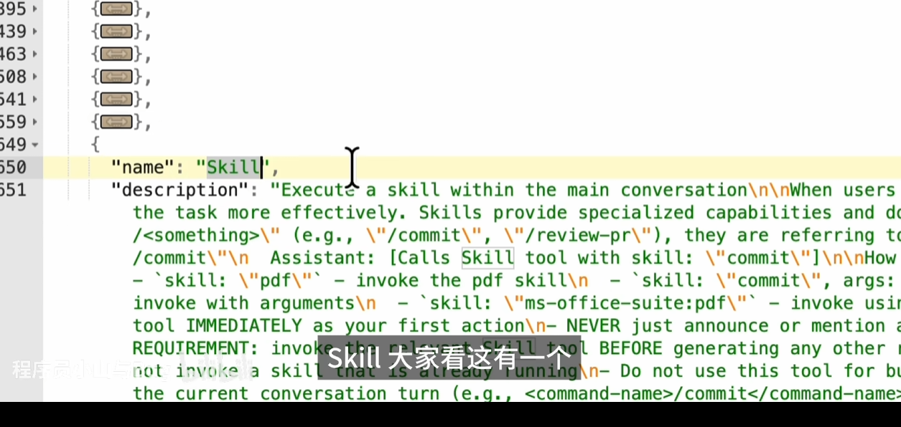

# AI技能——Agent Skill
参考资料：
[Agent Skill 从使用到原理，一次讲清](https://www.bilibili.com/video/BV1cGigBQE6n?t=214.2)
## Skill的发展
2025年10月，`Anthropic`正式发布了Agent Skill
在12月，Anthropic发布了`Agent Skill的开放标准`
至此，Agent Skill成为了一个AI Agent领域的一个**正式的标准**（而不单单局限于Claude Code）

## 定义
Agent Skill从本质上来讲，就是一本<u>**关于AI Agent的说明书，使用指南**</u>。可以<u>供大模型随时翻阅查找</u>。
比如你正在培训一个`智能客服的AI Agent`
那么你可以这样设计它的`Skill`

```javascript
在你回答用户问题的时候，请注意：
- 首先必须先站在用户的角度，安抚情绪
- 其次，认真分析问题给出若干种合适的解决方案
- 另外要注意，遇到不明确的问题不要随意给出承诺
```

比如你正在培训一个`智能会议总结的AI Agent`
那么你可以这样设计它的`Skill`

```javascript
在总结会议纪要的时候，请按照以下几个方面去整理思考：
- 参会人员、及其对应的职位
- 会议的主题、内容
- 会议的时间、地点
- 会议得到的结论
```

它不同于在对话中你对大模型提出的要求，也许在有限的上下文中无法做到一直记住。但是Skill会在每次对话中，自动提供给大模型去翻阅、查找并记住。
## 基本用法
可以看到下面这个Skill.md文件内容


其中包括以下几个部分：
- 头部元数据（Meta Data）
用来描述Skill的名称（名字）和描述（这个Skill是用来干什么的）
- 指令（Instruction）
用来详细描述模型需要定义的规则

当我们配置好这个**会议总结的Skill**后
大模型就可以根据这个Skill，来自动总结会议纪要

例如让我们给大模型一个输入：

它能够按照我们Skill中的要求给出我们对应的结果，完全符合我们的预期。

整体过程的流程可以用下面这张图来概括


> 要注意的是，在一开始并不是把所有的Skill的全部内容发给大模型，而是仅仅发送一份**Skill清单**。然后大模型会根据需求选择：**我到底需要哪些Skill来完成任务**。
然后再由Claude Code把**大模型要的Skill的内容，全部完整的发给大模型**（说白了，就是按需加载，也会节省token）。

## 【高级用法】Reference
例如：当会议中谈论到了**钱**的时候，希望总结告诉我们这个钱是否合法合规，符合集团财务预算。
同理，当会议中出现**合同**相关的内容时，也希望在总结中加入相关的提示（合同是否有法务风险等等...）

那么此时，按照一般的做法。我们会把集团的财务文件、合同、法律法规相关的文件，全部写进Skill中 或者 告诉大模型。
这样一来会导致：
- Skill会变得特别臃肿
- 回答更加耗时
- 更消耗token

因此，`Agent Skill`提出了一种新的用法——**Reference**
在Skill.md中告诉大模型：
【财务提醒】
```markdown
财务提醒：仅在提到"钱、预算、采购、费用"等相关内容的时候，需要读取`集团财务手册.md`，然后指出会议中关于"钱、预算、采购、费用"等相关内容是否合法合规，符合集团财务预算。
并明确财务审批人，审批流程。
```
同理我们尝试了一遍上面的流程，会发现Agent Skill在读取到`会议总结助手`的时候，也会读取到`集团财务手册.md`并询问是否需要读取这个文件然后给出对应的要求，就是我们上面写的【财务提醒】。
如下图：

最后它会给我们一个符合要求的回答，如下：
```markdown
●-参会人员：老陈、小李-议题：安排下周二上海出差事宜，包括签约大客户、酒店预订及客户宴请。
-决定：小李当天提交出差申请，按住宿1200元、餐饮3000元(6人)的标准预订外滩附近酒店
-财务提醒：住宿1200元/晚超出一线城市标准（800元/晚)400元；餐饮人均500元达到高消费地区提交业务副总裁(VP)特批方可报销。
```
> 当然了，如果输入中没有包含任何钱的内容，那么大模型就不会读取`集团财务手册.md`，自然也不会消耗token。

以上就是Reference的核心原理：**条件触发**
## 【高级用法】Script
前面我们说的都是如何更好的优化提示词，以便得到我们预期想要的结果。
如果Skill能够真的帮助我们干活的话，那岂不是最完美的方案
比如这样的需求：每次会议结束之后，总结完会议绩效，并自动上传到服务器存档。

那么此时，我们可以在Skill中加入以下内容：
```markdown
【上传规则】
如果用户提到“上传”、“同步”或“发送到服务器”，你必须运行upload.py脚本将总结内容上传到服务器。脚本使用方法：`python upload.py "会议总结内容"`
```
按照上面的流程操作一遍：
1. Claude Code第一步还是会询问是否要使用`会议总结助手`Skill
2. 接着， Claude Code会询问是否需要使用`上传规则`Skill然后运行`python upload.py "会议总结内容"`上传到服务器

注意这里的第二步，你写的`upload.py脚本`是**不会被读取的，仅仅是被执行**。
Claude Code只关心脚本的运行方式以及运行结果，**不会去读取脚本中的内容**。
这样也会极大的节省token的消耗。

因此，Script与Reference的区别在于：
- Script是**直接运行**的，其内容**不会被读取**
- Reference是**根据条件触发**的，需要加载内容到上下文，因此其**内容会被读取**

## 渐进式披露机制


## Skill 与 MCP 的区别


- **MCP**：给大模型提供给数据
- **Skill**：教大模型如何处理数据

本质上来说，<u>Skill也能够运行代码</u>。就好像瑞士军刀也能用来切菜，但是没有人这么做。
在执行代码方面，MCP比Skill更加的合适，不论是**安全性还是便捷性层面**。
当然了，两者各有所长。在常见的业务中，一般都是**MCP + Skill**两者高效结合使用~

## 【额外】Skill的表现
Skill在请求体中的表现本质是一个Function Calling
其中做了一些动态的拼接，将目前可用的Skill列表，动态的拼接成一个Function Calling的参数
然后传递给大模型
