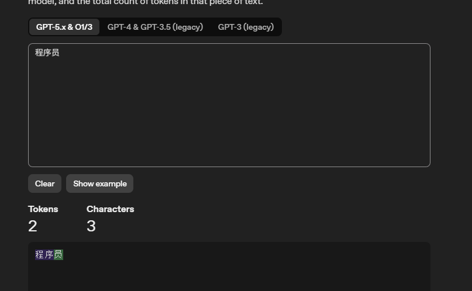

# Token（词元）
## 含义
大模型被叫做<u>大语言模型</u>，因此**Token**是大模型**处理文本**的**最基本单元**
大模型本质上是一个**庞大的数学函数**，*入参*是*数字*，*出参*也是*数字*（大模型只认识 数字）
因此，在我们人类和大模型之间，需要有一个中间人作为翻译。不然都是数字谁看得懂？
这个中间人叫做 **Tokenizer**
它只负责两件事：*编码和解码*（也就是*加密和解密*）
- 【编码】文字 —> 数字
- 【解码】数字 —> 文字
比如，当你询问大模型的一句话：
今天的天气怎么样？*【语句 A】* ，它会被编码成了 **[35,36,34,9]**
那么这一步是如何做到的呢？
## 拆词形成token
比如**今天的天气怎么样**这句话被拆分成为固定的几个词语，这里被分为了4个Token：
今天、的、天气、怎么样
## 映射Token
上面说到的四个`Token`，要被拆分为大模型所认识的数字（这被叫做`Token ID`）
因此四个`Token`就会被拆分为四个`Token ID`
`Token ID` 与 `Token` 是一一对应的，**意义是一样**的只是**表现形式不同**。
## 传输到模型
上面说到的中间人（**Tokenizer**）把生成的一串Token ID给送入到大模型中
## 大模型回答
大模型接受到之后，然后吐出对应的Token ID（这就是我们想要的回答）
中间人（**Tokenizer**）再次发挥作用，把`Token ID` 转为 `Token`，这样我们就可以看到回答了
但是有一点注意，大模型一次只吐出一个Token ID，也就是转换成一个`Token`
这也对应了大模型的回答每次都是一个词一个词（Token）的往外蹦出来
但是这里有一点需要注意一下，一个Token往往不一定等于中文的一个词语，也不一定等于英文中的一个单词
比如我们常说的**程序员**这个词语，简单理解的话它作为一个完整的词语应该就等于一个`Token`，但`其实不然`：

## Token理解
`Token`平均来说大约等于 **0.75个英文单词**，**1.5-2个汉字**
严格意义上来说，它算是大模型自己学会**一套新的切分文本的规则**

因此，从记忆上来说，我们可以理解为`Token` = `词元`